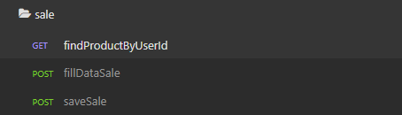
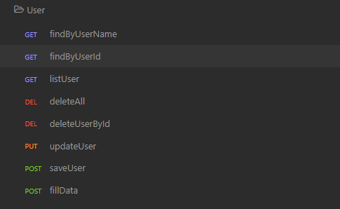
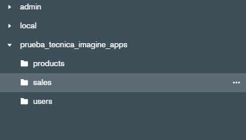

# Prueba Técnica Backend(_Spring boot, Mongo DB, WebClient, API Fakestore_)

## Ejecución del proyecto

_`Mongo db: localhost:27017`_ 
 _`localhost:8080`_

### Dependecias necesarias para la ejecución del proyecto  📦

    <dependencies>
        <dependency>
            <groupId>org.springframework.boot</groupId>
            <artifactId>spring-boot-starter-data-mongodb</artifactId>
        </dependency>
        <dependency>
            <groupId>org.springframework.boot</groupId>
            <artifactId>spring-boot-starter-web</artifactId>
        </dependency>

        <dependency>
            <groupId>org.springframework.boot</groupId>
            <artifactId>spring-boot-devtools</artifactId>
            <scope>runtime</scope>
            <optional>true</optional>
        </dependency>
        <dependency>
            <groupId>org.projectlombok</groupId>
            <artifactId>lombok</artifactId>
            <optional>true</optional>
        </dependency>
        <dependency>
            <groupId>org.springframework.boot</groupId>
            <artifactId>spring-boot-starter-test</artifactId>
            <scope>test</scope>
        </dependency>

        <!-- https://mvnrepository.com/artifact/org.springframework/spring-webflux -->
        <dependency>
            <groupId>org.springframework</groupId>
            <artifactId>spring-webflux</artifactId>
            <version>5.3.20</version>
        </dependency>

        <!-- https://mvnrepository.com/artifact/com.google.code.gson/gson -->
        <dependency>
            <groupId>com.google.code.gson</groupId>
            <artifactId>gson</artifactId>
            <version>2.9.0</version>
        </dependency>

        <!-- https://mvnrepository.com/artifact/com.fasterxml.jackson.core/jackson-core -->
        <dependency>
            <groupId>com.fasterxml.jackson.core</groupId>
            <artifactId>jackson-core</artifactId>
            <version>2.13.2</version>
        </dependency>

        <!-- https://mvnrepository.com/artifact/org.springframework.boot/spring-boot-starter-webflux -->
        <dependency>
            <groupId>org.springframework.boot</groupId>
            <artifactId>spring-boot-starter-webflux</artifactId>
            <version>2.7.0</version>
        </dependency>
    </dependencies>

### Organización de carpetas

`adapters`
* **commands**
* **queries**
* **webclients**

`domain`
* **collections**
* **dto**
* **repository**
* **utils**

`application`
* **mappers**
* **service**
* **utils**

### JsonReader
_Se crea una clase llamada JsonReader que permite convertir el Data.json en objetos

### Endpoints  📌

_command controller "User, Product, Sale"_
`PUT, POST, DELETE`

_query controllers "User, Product, Sale"_
`GET`

### pruebas manuales con insomnia y postman
--> Se agrega colección de insomnia
## Pagina

### DB Mongo

## Autora ✒️
* **Lina Maria Guerrero** - *Prueba técnica Backend Spring Boot* - [LinaDev14](https://github.com/LinaDev14)